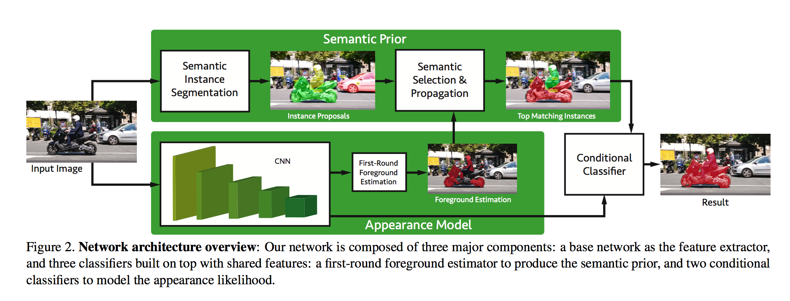
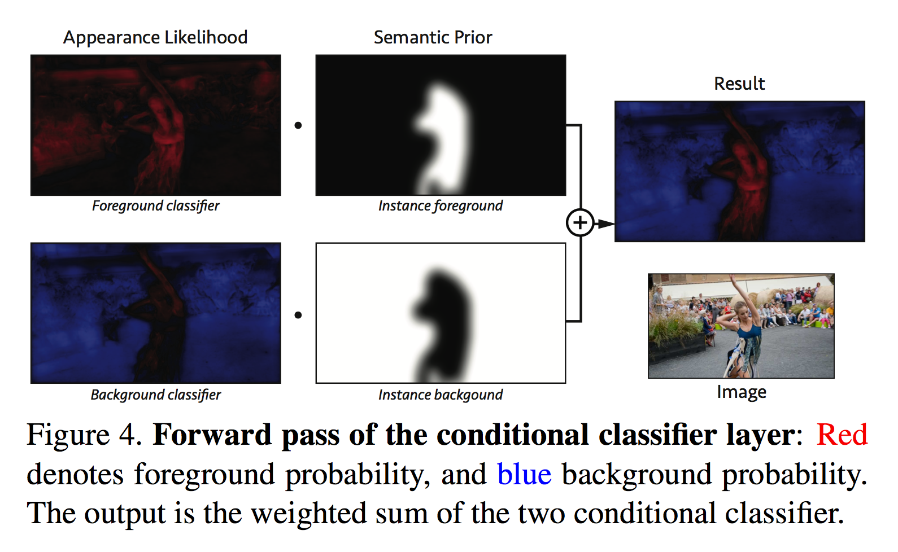
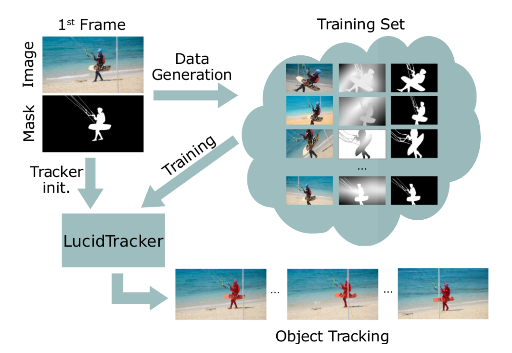
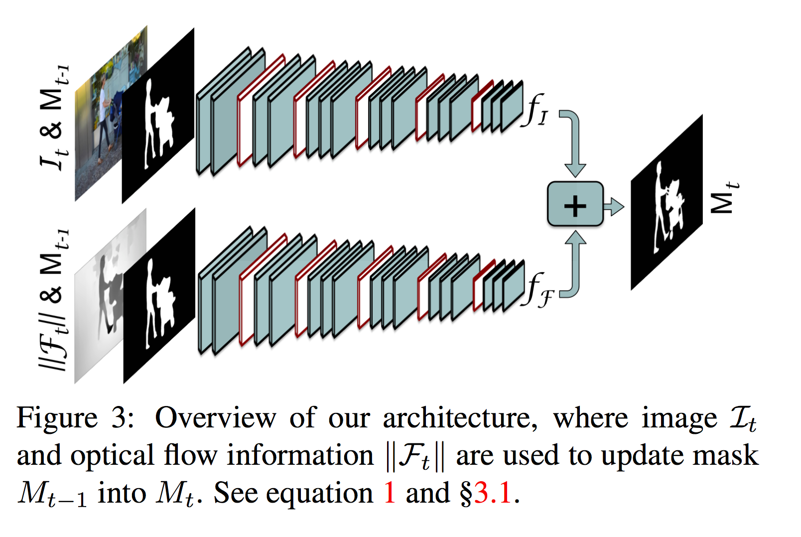
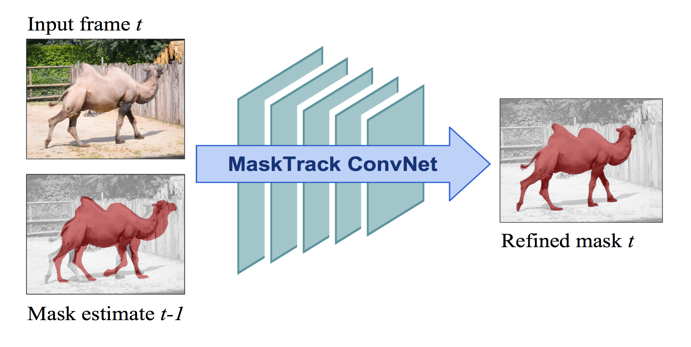
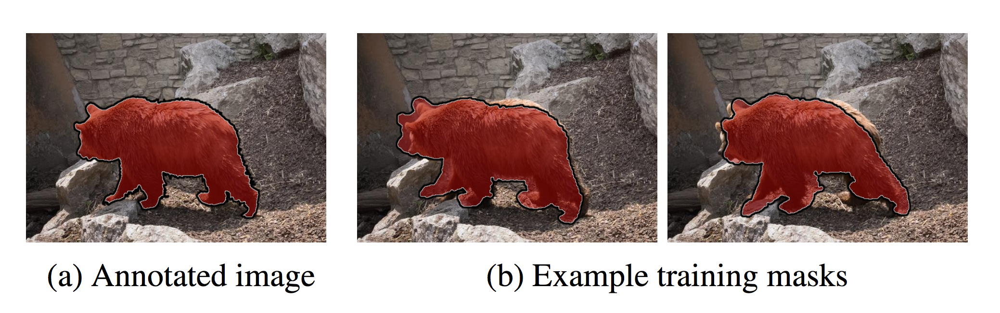
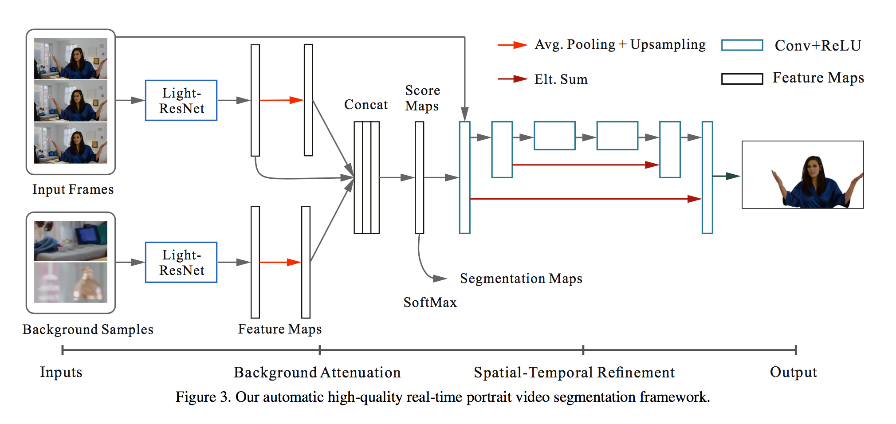
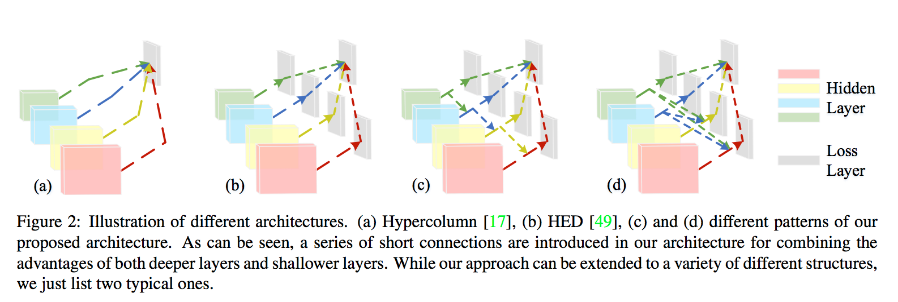

> 没啥好说的。

<!--more-->

## Semantically-Guided Video Object Segmentation

这篇论文我很喜欢，更符合人类的认知过程。

该篇论文提出的方法是模拟人类在视频中追踪物体的情形，人们在视频追踪的时候分为两种情形，一种是连续的画面，那很自然的就由上一帧的物体所在点过渡过来；但是当漏了几秒没看的时候，人们是怎么识别物体的呢？这就是该篇论文的出发点，语义分析追踪。即我第一帧看到了车，在画面不能连续起来的时候我就去找“车”这个语义在图片哪里。

对于第一帧图片使用FCN对图片中的各种物体做出像素级预测，然后寻找与mask重合最多的预测，比如说是car。对后面的帧预测的时候，即可先对图片做语义分割，然后找语义为car的预测，在于上一帧的mask结合，做出预测。总体结构如下

论文还提出了一个conditional classifier layer，主要功能是视情况结合propagation的结果和semantic segmentation的结果。比如物体移动非常剧烈的时候只采用semantic segmentation，放弃propagation的mask；而又多个相同语义的物体时则要侧重于propagation的结果（具体实现以后还要再看下）。

这篇论文我觉的最符合人类的直观认识，不知道还能不能再从这方面深入挖掘一下。

## Lucid Data Dreaming for Object Tracking

该篇论文主要提出了一种增强数据的方法，可以只用训练集里的数据就达到较好的效果。

按照以下五步来

1. 光照随机变化，变换HSV中S和V
2. 把前景抠出来，补全背景
3. 随机移动、变形前景
4. 随机模拟相机变化，平移、旋转、放缩
5. 前景背景结合

作者用一帧生成$$10^3$$级别的训练数据，效果相同的情形下数据量仅为原来的$$\frac1{100}$$到$$\frac1{20}$$。这种数据生成是跟网络完全独立的，可以用在以后的训练中。

作者训练用的模型是结合上一帧的mask与optical flow的模型，不是本文研究的重点，简要介绍了一下。

## Learning Video Object Segmentation from Static Images

这篇论文提出将视频vido object segmentation看做是guided instance segmentation。本文的模型是先用静态图像预训练convnet，再由视频中的前几帧引导，生成高精确度的分割。

模型的关键在于离线和在线算法的结合，离线算法用于学习物体的特征，在线算法refine mask。大步骤跟OSVOS基本一致，但本质思想不同

### 与OSVOS的区别

1. 总体思路是Mask Track，而OSVOS则是Mask再识别。对于当前帧的预测，该篇论文使用当前帧帧的前几帧做引导，但OSVOS只是用了视频的第一帧，即没有propagation的过程。只用第一帧可能会导致效果随着时间下降（与第一帧差异越来越大）。

2. * 第一步pre-training，同样是图像识别
   * 第二步offline training，OSVOS是使用训练集使网络学习mask的广义概念，而该篇则注重使网络学习如何propagating（根据前几帧的mask和当前帧推导出当前帧的mask）
   * 第三步online training，同样是使用test视频的一张标注来refine，而OSVOS还有轮廓的CNN预测来提高精确度。该篇的refine是通过对第一张mask进行各种变换形成许多训练数据，用这些数据训练网络，在test时用第一张标注辅助propagation（类似广义mask）
   * Test，OSVOS只用第一张进行mask预测，该篇除了使用propagation以外也同样将第一张标注用于所有图像的mask预测

   主要区别在于第二步，第三步中OSVOS的轮廓预测是独立的模块，可以应用到该篇

### 训练细节

使用的网络是DeepLabv2-VGG network，

第二步的实际训练方式是先将前一帧的mask做一些形态学变换模拟各种噪声，增大数据量，同时使用图片识别的mask进行一些形态学变换，来模拟前一帧与当前帧的差异。这样就可以使用图片识别的数据集进行训练，数据量大大提升。）

作者还提出了几种guidence的变体，有box annotation和optical flow

第一张的online finetuning要200次迭代，加上第一张的fintuning平均每帧的预测要12秒

## Automatic Real-time Background Cut for Portrait Videos

这篇论文是讲怎么从视频里实时抠出人像的，主要是借鉴OSVOS来学习背景。

该网络先学习许多背景的采样，再跟原视频结合，达到更好的消除效果，称为global attenuation

感觉这个问题与video object segmentation差别比较大，因为人的大小基本恒定，而且背景一般是静态的。该网络对于动态背景的表现很差。

启发点可能有对于背景的学习是否可以更重视一些？

## Deeply Supervised Salient Object Detection with Short Connections

在HED中，深层的side outputs主要用于定位，浅层的side outputs主要用于表达细节，这启发了作者使用short connections在HED内部构建skip-layer，更好的结合深层与浅层的能力。下图的c和d是作者提出的模型。（以下暂称SCHED(short connected HED)，作者没给官方简称…）

这个网络的具体应用我觉得可以有以下几种途径

1. OSVOS跟进，用这个网络与ImageNet预训练的网络（或者合并成一个预训练过的网络）共同学习如何区分前景和后景，提升OSVOS区分mask的能力，总体步骤不变。
   - 优势：mask一般是salient object，应该学习起来比较容易，而且SCHED带有轮廓学习能力，可以省略OSVOS中的轮廓CNN，提升速度，简化模型
   - 劣势：有时候mask是不起眼的物体，比如远处来的赛车，一开始很小，这种情况可能学习起来比较困难
2. Learning Video Object Segmentation from Static Images跟进，用SCHED代替optical flow，与propagation结合
   * 优势，更快，轮廓更精确
   * 劣势，没有明显的理由表明会提升表现

